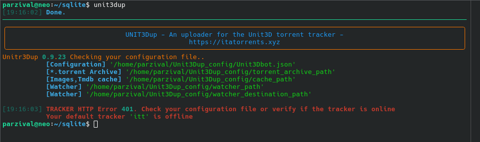

# Indice
- [Installa il bot su ultra.cc](#sezione-1)
- [Installare Redis su ultra.cc senza sudo](#sezione-1)
- [Uso del flag -watcher](#sezione-2)


# Installa Unit3dUp su seedbox ultra.cc
----

## Ultra.cc non permette l'uso di Sudo

Il bot richiede python con versione minima 3.10 e max 3.12.
python 3.14 risulta essere ancora troppo recente per alcune librerie (12/4/2026)

Utilizziamo **pyenv preinstallato su ultra.cc**. Unico problema pyenv non installa sqlite3.

Sqlite3 viene utilizzato dal bot come cache per screenshot e ricerche su tracker.

Occorre quindi installare sqlite3 (un paio di comandi) e poi python 3.12

---

### Installare sqlite3

Per installare sqlite3 non possiamo utilizzare sudo quindi dobbiamo compilare

Va in home

- ```cd ~```

Scarica il pacchetto con

- ```wget https://sqlite.org/2026/sqlite-autoconf-3510300.tar.gz```

Scompatta il pacchetto

- ```tar xvf sqlite-autoconf-3510300.tar.gz```

Entra nella cartella che hai ottenuto scompattando il tuo pacchetto

```cd sqlite-autoconf-3510300```

Lancia questi tre comandi uno dietro l'altro

```./configure --prefix=$HOME/sqlite```

```make```

```make install```

Imposta le variabili ambiente solo per questa sessione

Copia e incolla nel terminale 'ssh'

```
export PATH=$HOME/sqlite/bin:$PATH
export LDFLAGS="-L$HOME/sqlite/lib"
export CPPFLAGS="-I$HOME/sqlite/include"
export PKG_CONFIG_PATH="$HOME/sqlite/lib/pkgconfig"
export PYTHON_CONFIGURE_OPTS="--enable-loadable-sqlite-extensions"
```

### Installare python 3.12

Installa 

```pyenv install -f 3.12.0```

Setta python 3.10 come versione di sistema di default

```pyenv global 3.12.0```


Se hai già installato Unit3Dup, lancia il bot come primo test

```Unit3Dup```



I messaggi in rosso ti avvertono che non hai ancora configurato il tuo bot [Configurazione minima](config.md)


### Se su ultra.cc non esiste pyenv

Lancia nel terminale

```curl -fsSL https://pyenv.run | bash```

[Dal loro github](https://github.com/pyenv/pyenv?tab=readme-ov-file#linuxunix)

---

## Installare Redis su ultra.cc senza sudo

* wget https://download.redis.io/redis-stable.tar.gz

* tar xzf redis-stable.tar.gz

* cd redis-stable

* make

### Configura redis
- cd redis-stable
- nano redis.conf
  - verifica che sia presente la stringa "bind 127.0.0.1 -::1"
  - Cambia la porta da "Port 6379" a "Port 7000"
- cd src
- ./redis-server

### Configura memoria

-  ```under construction```

---

## Uso del flag -watcher

Il flag `-watcher` legge il contenuto di una cartella e lo sposta in una cartella di destinazione, poi carica tutto sul tracker.

### Come usare watcher

Il flag non accetta parametri.

```bash
python start.py -watcher
```
* watcher_path → configura percorso dove vengono scaricati i file

* watcher_destination_path → configura percorso dove Unit3Dup sposta i file per caricarli sul tracker

### Come configurare il watcher

Apri il file Unit3D.json con un editor di testo e imposta il parametro:

```WATCHER_INTERVAL```  ( in secondi)

Assegna un percorso a piacere per questi due parametri:
* ```watcher_path```
* ```watcher_destination_path```

Allo scadere di WATCHER_INTERVAL il bot esegue queste operazioni: 

* Controlla la cartella watcher_path
* Sposta tutti i file in watcher_destination_path
* Processa i file e li carica sul tracker

