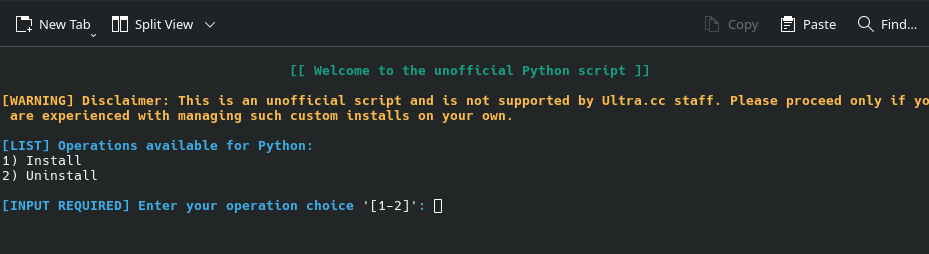
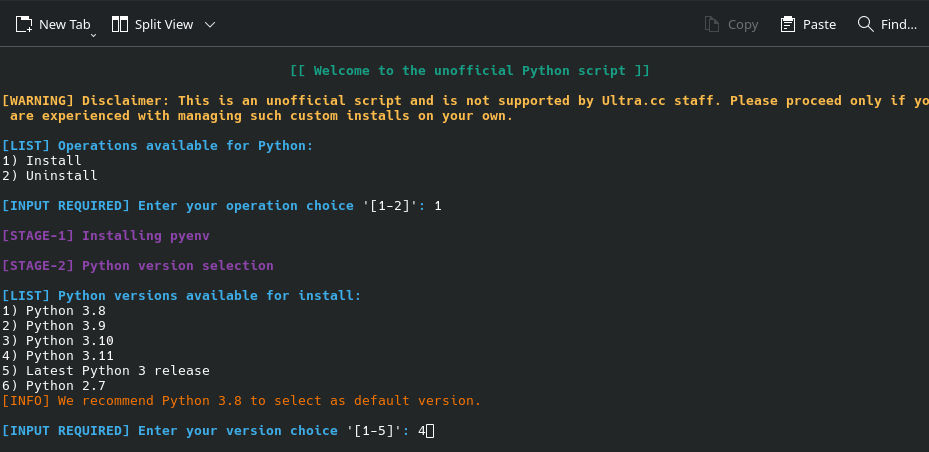
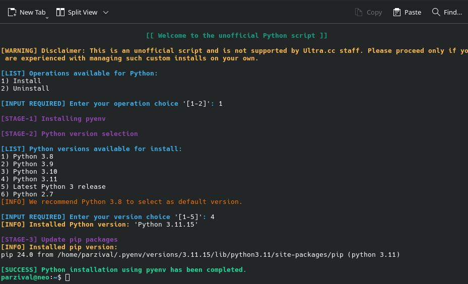

# Installare python oppure aggiornare la versione di python
----
## Guida per fare upgrade di python su ultra.cc

Nella documentazione di ultra.cc viene descritto quanto segue:

Copia e incolla poi premi enter

```bash <(wget -qO- https://scripts.ultra.cc/util-v2/LanguageInstaller/Python-Installer/main.sh)```

Lo script di installazione parte:



Basta osservare le immagini 



